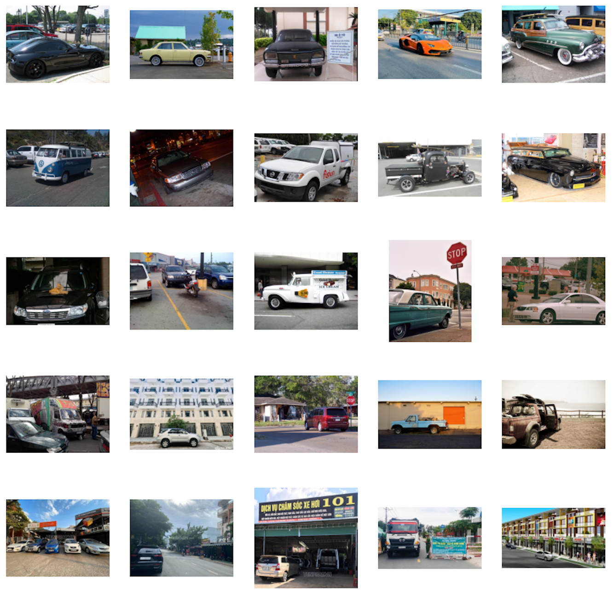

# Vietnamese CLIP

## Target of the Project
- **Develop and Deploy:** A sophisticated Vietnamese multimodal chatbot model capable of efficiently assisting customers in navigating the diverse offerings of fashion stores.
- **Enhance Customer Experience:** By reducing the time and effort required for shopping online, this project not only improves the productivity of fashion stores but also reduces operational costs and enhances overall business performance.
  
## Limitations and Challenges
- Lack of benchmarks and resources tailored specifically for languages such as Vietnamese.
- Current state of multimodal model architectures, such as CLIP, does not natively support languages like Vietnamese.

## Model
- **CLIP:** Has demonstrated remarkable capabilities in understanding and associating images with text.
- **PhoBERT Integration:** For the Vietnamese language, we harness the power of CLIP by integrating it with PhoBERT, a state-of-the-art text encoder trained specifically for Vietnamese.
- **LiT Techniques:** By fine-tuning the text encoder using image-text data, we further enhance the performance of CLIP with PhoBERT.

## Datasets
Limited options are available for image captioning datasets in the Vietnamese language.
- **Crossmodal-3600:** Introduced two multilingual datasets, COCO-35L and CC3M-35L.
  - **COCO-35L:** Consists of 113,287 images for training and 5,000 images for validation, with each image having 5 reference captions.
  - **CC3M-35L:** Comprises 3,318,270 image-text pairs for training and 15,840 image-text pairs for validation.
- **UIT-OpenViIC:** Introduced a dataset containing complex scenes captured in Vietnam and manually annotated by native speakers under strict rules and supervision. It includes 13,100 images, each with an average of 4.7 captions.
- **KTVIC:** Introduced a comprehensive Vietnamese Image Captioning dataset focused on daily life activities. This dataset comprises 4,327 images and 21,635 Vietnamese captions.

**Note:** The CC3M-35L dataset will be reserved for future development due to its large size. The total number of image-text pairs trained is 666,518 pairs.

## Inference
### Text-only
- **Query:** *cô gái mặc áo dài* (a girl in Ao Dai)
  - **Top match:**
  

- **Query:** *một người đang dùng máy tính* (a person using a computer)
  - **Top match:**
  

- **Query:** *xe hơi đậu trước ngôi nhà* (a car parks in front of a house)
  - **Top match:**
  

- **Query:** *em bé chơi đùa cùng đồ chơi* (a baby plays with toys)
  - **Top match:**
  

### Image-only
- **Query:** 
  - **Top match:**
  

- **Query:** 
  - **Top match:**
  

- **Query:** 
  - **Top match:**
  

- **Query:** 
  - **Top match:**
  

### Image and Text
- **Image query:** 
  - **Text query:** *nhiều người tham quan* (many people visit)
  - **Top match:**
  

- **Image query:** 
  - **Text query:** *chú chó vui vẻ* (a happy dog)
  - **Top match:**
  

- **Image query:** 
  - **Text query:** *đi siêu thị* (go to supermarket)
  - **Top match:**
  

- **Image query:** 
  - **Text query:** *thành phố* (a city)
  - **Top match:**
  

More details in report.